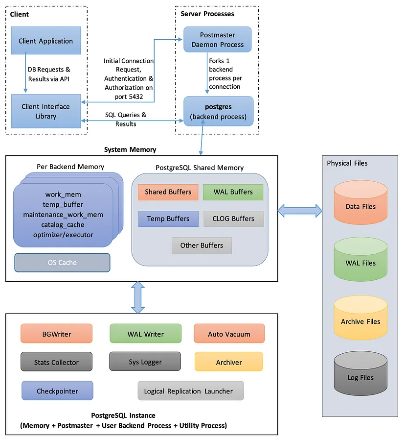

# PostgreSQL 示例项目

本项目包含了多个 PostgreSQL 相关的示例配置，每个子目录都是一个独立的示例。

## PG架构图

## 目录结构

### [pg-single](./pg-single/README.sh)
基础的单节点 PostgreSQL 配置示例
- 使用 PostgreSQL 16
- 基本的数据库配置
- 数据持久化
- 端口映射：15432

### [pg-cron](./pg-cron/README.sh)
带有 pg_cron 插件的 PostgreSQL 配置示例
- 基于 PostgreSQL 16
- 集成 pg_cron 定时任务插件
- 配置中国时区 (Asia/Shanghai)
- 端口映射：15432

## 快速开始

每个示例目录都包含独立的 README 文件，提供了详细的使用说明。点击上面的链接可以查看具体的使用方法。

